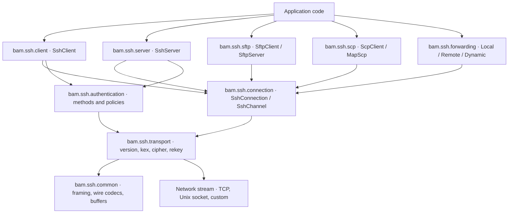
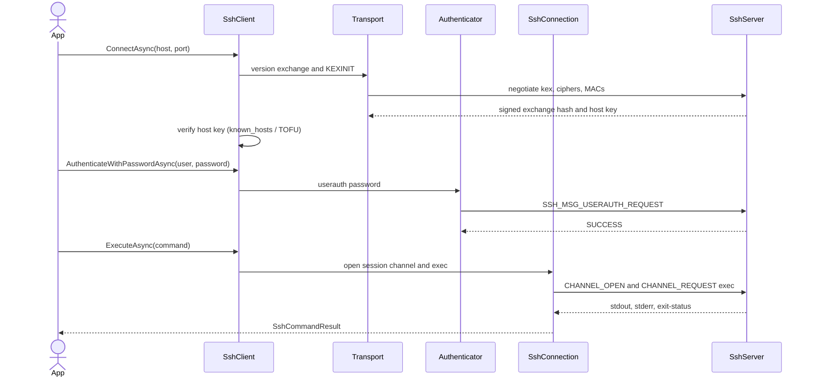

# bam.ssh documentation

`bam.ssh` is a from-scratch SSH client and server protocol stack in modern C# (.NET 10) — no OpenSSH
P/Invoke, no libssh, implemented directly against the RFCs. This is the documentation hub: the architecture
at a glance, a guided reading order through the per-layer protocol walkthroughs, and pointers to the usage
guide, the decision log, and the benchmarks.

- **New here?** Start with the [getting-started guide](guides/getting-started.md) for copy-pasteable recipes.
- **Want the design rationale?** Every non-obvious choice is in [`decisions.md`](decisions.md) (D-001 … D-020).
- **Want the phase/RFC map?** See [`project-plan.md`](project-plan.md).

## Architecture

The stack is strictly layered and one-directional: each layer depends only on the ones below it, and the
protocol-pure core (`bam.ssh.common` … `bam.ssh.connection`) has **zero dependencies outside this repository**
so it stays Native-AOT / trim-safe.

A typical client session — connect, verify the host key, authenticate, then run a command — flows through the
layers like this:

Two invariants shape the whole design:

- **One reader, one writer per connection.** `SshConnection` is the sole reader and sole writer of the
  authenticated transport; every channel multiplexes through it, and automatic re-keying pauses application
  traffic from that single owner. This is the only race-free way to share a non-thread-safe byte stream.
- **Ref-struct-safe async.** The wire codecs (`SshWireReader`/`SshWireWriter`) are ref structs that cannot
  cross an `await`, so every layer parses a message synchronously into a plain object *before* doing async
  work.

## Protocol walkthroughs — recommended reading order

Each layer has a walkthrough explaining what it does, the RFCs it implements, and what its phase proved. Read
them bottom-up to build the stack in your head, or jump to the one you need.

| # | Walkthrough | Layer / feature |
|---|---|---|
| 1 | [packet-layer.md](protocol/packet-layer.md) | Binary encoding (RFC 4251), packet framing (RFC 4253 §6), sequence numbers, buffer pooling |
| 2 | [transport-layer.md](protocol/transport-layer.md) | Version exchange, the packet pipeline, disconnect/ignore/debug |
| 3 | [key-exchange.md](protocol/key-exchange.md) | curve25519-sha256, ecdh-sha2-nistp256, dh-group14-sha256; KEXINIT; the exchange hash |
| 4 | [encryption.md](protocol/encryption.md) | chacha20-poly1305, AES-GCM, AES-CTR + HMAC-SHA2; rekeying |
| 5 | [authentication.md](protocol/authentication.md) | password, publickey, keyboard-interactive; key file formats |
| 6 | [connection.md](protocol/connection.md) | Channels, window flow control, exec/shell/subsystem, PTY, signals |
| 7 | [client.md](protocol/client.md) | `SshClient`, known_hosts/TOFU host-key trust, keep-alive |
| 8 | [server.md](protocol/server.md) | `SshServer`, auth policies, command handlers, limits |
| 9 | [sftp.md](protocol/sftp.md) | SFTP v3 (OpenSSH-compatible), client + server, virtual filesystem |
| 10 | [scp.md](protocol/scp.md) | SCP `scp1` binary protocol, client + server, over `exec` |
| 11 | [port-forwarding.md](protocol/port-forwarding.md) | Local `-L`, remote `-R`, dynamic SOCKS `-D` (RFC 4254 §7) |
| 12 | [performance.md](protocol/performance.md) | Benchmark harness, allocation elimination, findings |

## Projects

| Project | Root namespace | Purpose |
|---|---|---|
| `bam.ssh.common` | `Bam.Ssh` | Wire codecs, packet encoder/decoder, framing, sequence numbers, buffer pooling |
| `bam.ssh.transport` | `Bam.Ssh.Transport` | Version negotiation, key exchange, packet encryption/authentication, rekeying |
| `bam.ssh.authentication` | `Bam.Ssh.Authentication` | password / publickey / keyboard-interactive; key readers and signers |
| `bam.ssh.connection` | `Bam.Ssh.Connection` | Channels, flow control, exec/shell/subsystem, env, PTY, signals, global requests |
| `bam.ssh.sftp` | `Bam.Ssh.Sftp` | SFTP v3 protocol, `SftpClient`/`SftpServer`, `ISftpFileSystem` |
| `bam.ssh.scp` | `Bam.Ssh.Scp` | SCP protocol, `ScpClient`, server exec handler |
| `bam.ssh.forwarding` | `Bam.Ssh.Forwarding` | TCP/IP forwarding, SOCKS, the socket↔channel bridge |
| `bam.ssh.client` | `Bam.Ssh.Client` | High-level `SshClient` façade |
| `bam.ssh.server` | `Bam.Ssh.Server` | High-level `SshServer` façade |
| `bam.ssh.tests` | `Bam.Ssh.Tests` | bam.test unit tests |
| `bam.ssh.benchmarks` | `Bam.Ssh.Benchmarks` | Dependency-free benchmark harness |
| `bam.ssh.samples` | `Bam.Ssh.Samples` | Console samples |

## Tests and benchmarks

- **Tests** use the bamtk `bam.test` framework (not xUnit/NUnit). Every layer has unit tests, and Phases 7–11
  add crown-jewel tests that run the production `SshClient` against the production `SshServer` over a loopback
  transport — the whole stack, end to end. Run them via the bamtk `run-tests.sh` orchestrator, or directly:
  `dotnet run --project bam.ssh.tests -c Debug -- --ut`.
- **Benchmarks** (see [performance.md](protocol/performance.md)):
  `dotnet run --project bam.ssh.benchmarks -c Release -- [packet|channel]`.

## What is intentionally deferred

Tracked with rationale in [`project-plan.md`](project-plan.md) and [`decisions.md`](decisions.md): SSH1
(never), compression (`none` negotiated; hooks present), GSS-API auth, X11 / agent / StreamLocal forwarding,
SFTP v4–v6, and real-OpenSSH interop testing (every phase proves our-client ↔ our-server, not against `sshd`).
